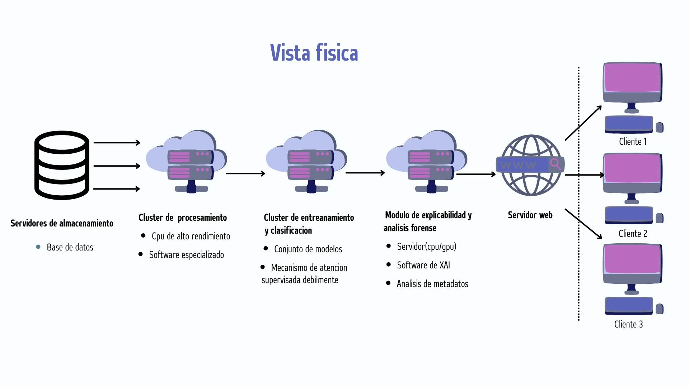

# 🕵️‍♂️ Detección Multimodal de Deepfakes con IA Explicable (XAI)


> **Proyecto de Ingeniería de Software - Universidad Nacional de Ingeniería (UNI)**
> *Un marco híbrido (XAI-ART) para la detección robusta de deepfakes en audio, video e imágenes.*

## 📄 Descripción

Este proyecto implementa un sistema de **Detección Multimodal de Deepfakes** diseñado para combatir la suplantación de identidad digital. A diferencia de los detectores tradicionales de "caja negra", este sistema integra **Inteligencia Artificial Explicable (XAI)** mediante Grad-CAM, permitiendo a los analistas forenses visualizar *por qué* el modelo clasificó un contenido como falso.

El sistema utiliza un **Ensamble Ponderado** de arquitecturas robustas (Xception y CNN personalizada) y análisis de espectrogramas para audio, orquestado a través de una interfaz web intuitiva en Gradio.

## ✨ Características Principales

* **🔍 Análisis Multimodal:** Soporte para Imágenes (JPG, PNG), Video (MP4) y Audio (WAV, MP3).
* **🧠 Ensamble de Modelos (Weighted Voting):** Combina Xception (30%) y CNN (70%) para mejorar la generalización en imágenes y video.
* **🔥 Explicabilidad (XAI):** Generación de mapas de calor **Grad-CAM** para resaltar regiones manipuladas en el rostro.
* **📊 Análisis de Video Frame-a-Frame:** Estrategia de muestreo (1 fps) para balancear precisión y rendimiento.
* **🎙️ Forense de Audio:** Detección de clonación de voz mediante conversión a Espectrogramas Mel y análisis CNN.
* **📝 Metadatos e IA Generativa:** Extracción de metadatos EXIF y detección de prompts de IA (Stable Diffusion, Midjourney).

## 🛠️ Arquitectura del Sistema

El sistema sigue una arquitectura por capas, separando la lógica de presentación (Gradio), la lógica de negocio (Inferencia y XAI) y el acceso a datos.



## 🚀 Instalación y Puesta en Marcha

### Prerrequisitos
* Python 3.8 o superior
* GPU recomendada (NVIDIA CUDA) para inferencia rápida.

### 1. Clonar el repositorio
```bash
git clone [https://github.com/FlavioGF23/Proyecto-software-2025-2.git](https://github.com/FlavioGF23/Proyecto-software-2025-2.git)
cd Proyecto-software-2025-2
